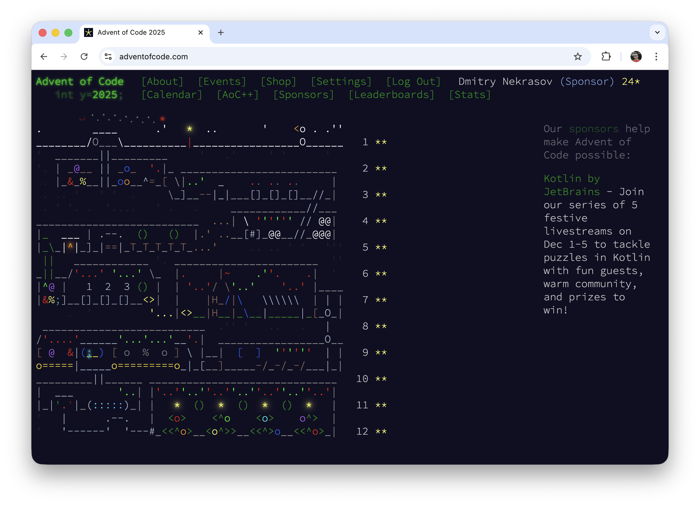

# Advent of Code 2025: Fewer Days, Deeper Math 🧮

I finished Advent of Code again this year. It is my third year in a row. [2023](https://github.com/DmitryNekrasov/AoC-2023) was about using many languages. [2024](https://github.com/DmitryNekrasov/AoC-2024) was full of graph problems in Kotlin. This year I focused more on math, careful models, and using my own tools.

There were only 12 days, but many puzzles were very hard. It felt like a small course in algorithms, not just a simple puzzle calendar.

**Day 1** was a good start. There was a dial with 100 positions. The important idea was to use modular arithmetic and math, not simulate every click. Counting how many times we pass zero with simple formulas felt very nice.

**Day 2** was about special numbers with repeated patterns. In Part 1 I could use a clean math formula. In Part 2 I had to generate candidates more directly, but still in a smart way, not just brute force everything.

**Day 3** and **Day 5** were problems I like. In one, I chose digits to get the biggest number, using a greedy method. In the other, I merged ranges so I do not count numbers twice. The final code looks simple, but I had to think a lot to trust the logic.

**Day 4** felt like a small simulation. I removed “easy to reach” rolls again and again until nothing changed. It was like peeling an onion: take off the outside layer, then the next, and so on.

**Day 6** was where things became strange in a fun way. Numbers were written in columns. In Part 2 I had to read them by columns from the right side. I could not just parse normal integers. I had to work with raw characters and positions.

In the middle of the event, I saw more graphs and dynamic programming. **Day 7** had a beam that splits time into different timelines. Part 2 became a path counting problem where I track how many paths visit special nodes.

**Day 8** was clearly a minimum spanning tree problem. We had junction boxes in 3D and needed to connect them with the smallest total distance. I used Kruskal’s algorithm with DSU, and it fit the story perfectly.

The hardest part for me was Days 9, 10, and 12. **Day 9** asked for the biggest rectangle and then said it must stay inside a polygon. I did not want to write heavy geometry code, so I used a Monte Carlo method with random points to test if the rectangle is inside.

It felt strange to use a probabilistic solution in AoC, but it worked well. The problem limits were small, and the polygon was simple, so many random checks were enough to be sure.

**Day 10** was on another level. Part 1 was BFS on bitmasks: each state is a light configuration, each edge is a button press. Classic task. Part 2 changed everything: now I had to solve a system of linear equations with non‑negative answers and a minimum number of presses.

At some moment I understood: “This is a system Ax = b, I must use the Gaussian method.” After that, the main work was careful implementation: keep numbers small and use backtracking for free variables.

**Day 11** again used a DAG, but this time I tracked different types of paths: all paths, paths through dac, paths through fft, and paths through both. I used a topological order and pushed these counts through the graph. Then I just read the final value I needed.

**Day 12**, the Christmas Tree Farm, was a big backtracking problem. I had to place shapes on a grid without overlap. I checked area first, then did a full search with rotations. I was ready for a very slow solution, but the full input finished in about 400 ms. Good test design helped a lot.

During all these days, my own library, kodvent, helped a lot. It has usefull extentions on maps, math functions, DSU, etc. Because of it, I could think more about the idea and less about simple code setup. Check out the library here: https://github.com/DmitryNekrasov/kodvent

When I compare this year with 2023 and 2024, I see progress. I am less afraid of hard math now. I switch between methods faster. And I trust my own infrastructure more, especially kodvent and my usual patterns.

I did not chase the leaderboard, but I did chase good ideas. Another Advent of Code is done, and I learned many new tricks. Big thanks to [Eric Wastl](https://github.com/topaz) and the AoC community. See you next year - with Kotlin, kodvent, and maybe even stranger solutions.
